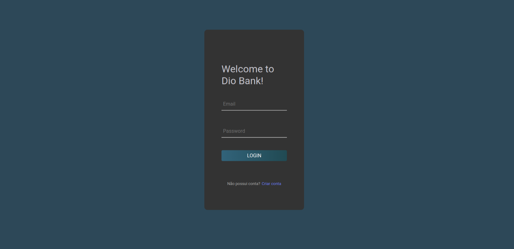

# DIO Bank - TypeScript

## Sobre

Projeto sendo desenvolvido na Formação TypeScript Fullstack Developer pela DIO.
Conceitos básicos de TypeScript usando React.

## Desafios

- [ ] Validação da senha no campo de login

- [ ] Implementação de sistema de login com a Context API

- [ ] Exibição de informações do usuário após login na aplicação

- [ ] Deploy da aplicação no Netlify

